## 题目分析：
IDA载入，
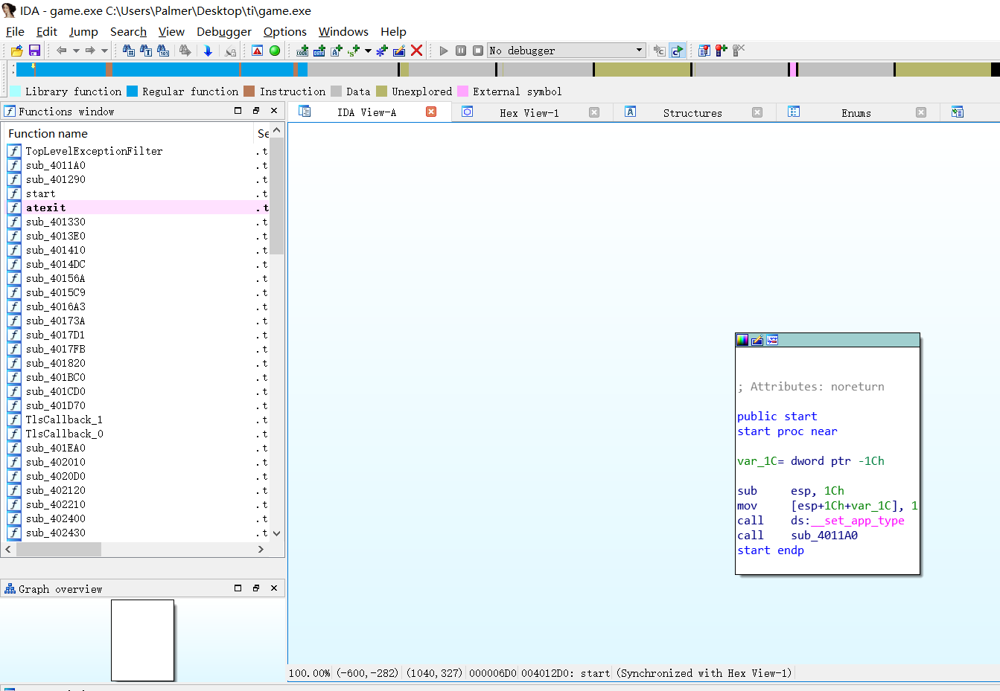
shift+F12查找字符串

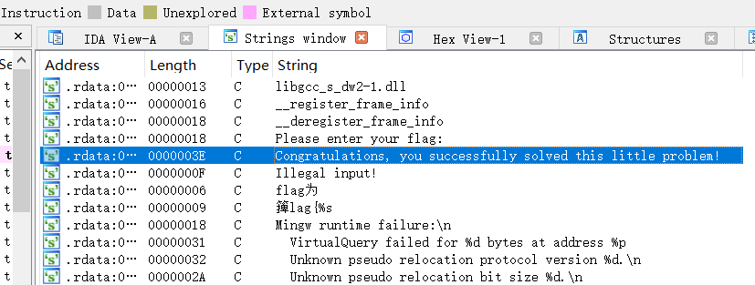

双击跟随到其所在的内存地址，摁'x'键交叉引用，找到调用此字符串的指令，来到关键代码。

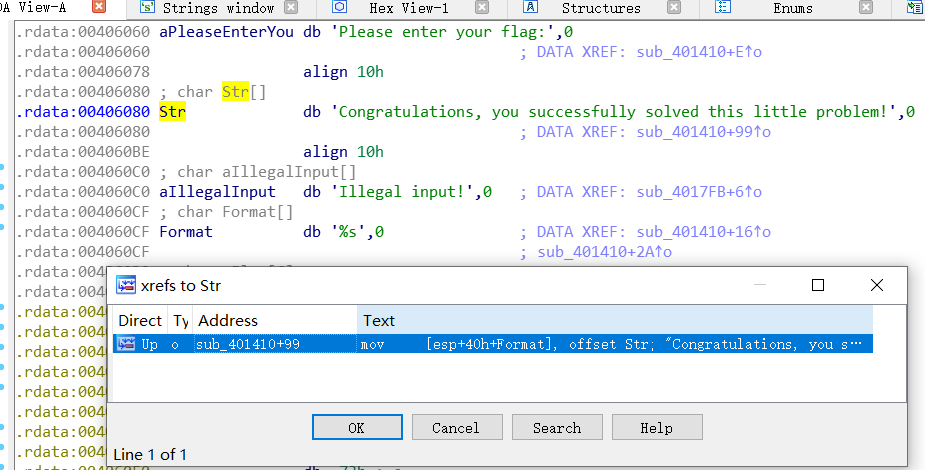

F5查看伪代码

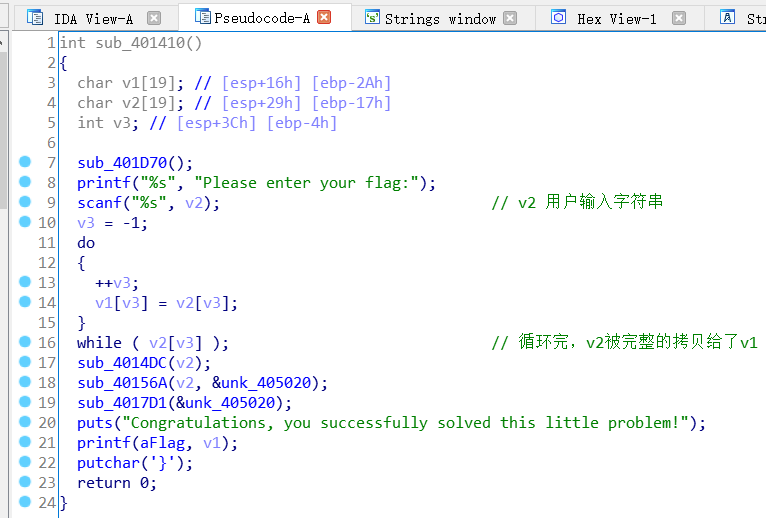

先分析sub_4014DC(v2)函数，双击进入分析

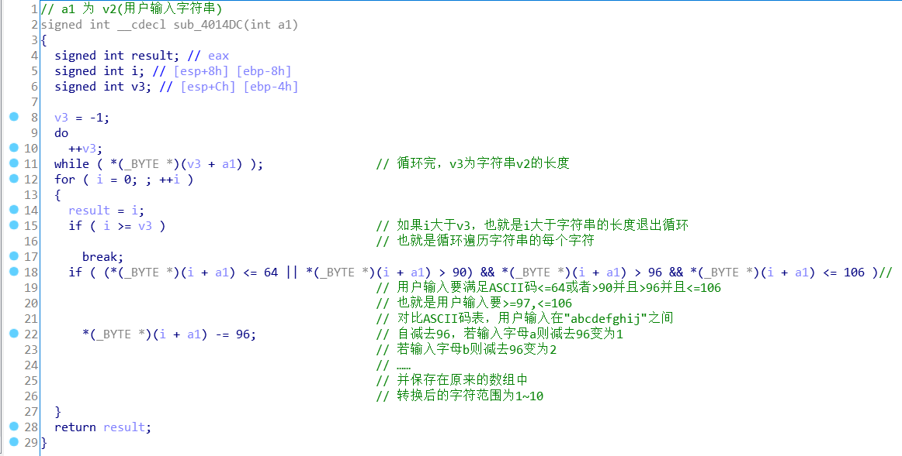

再分析sub_40156A(v2, &unk_405020)函数

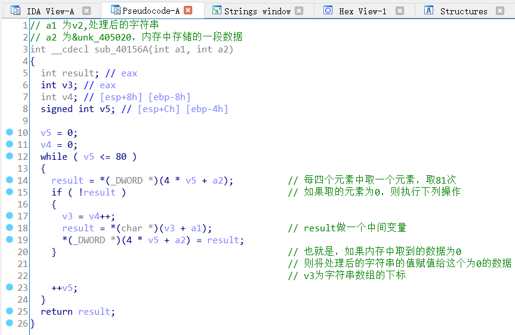

查看一下内存中存储的数据

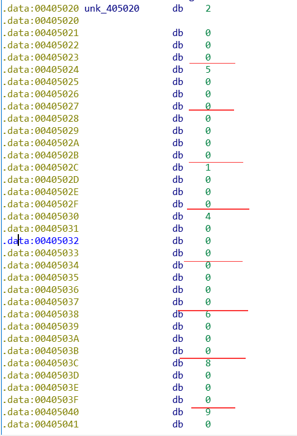

发现是每四个字节有一个数据，所以改一下数据类型更方便查看

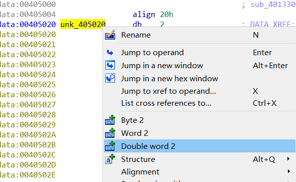

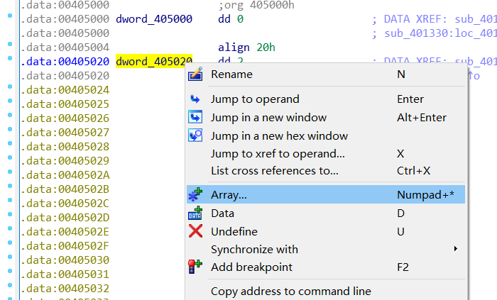

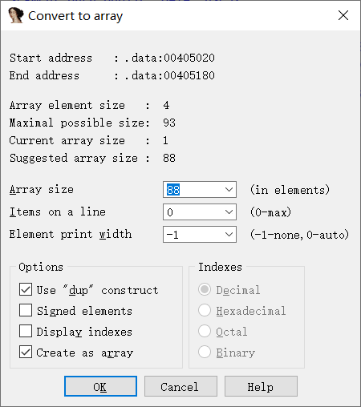

将他声明成一个数组，之后就好看多了

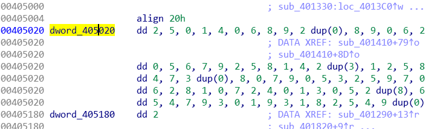

也就是每次的*4是乘以的类型长度。数组的类型长度为4字节，也就是int……

看一下sub_4017D1(&unk_405020)函数，由三个函数组成

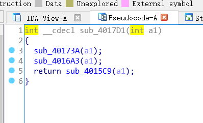

sub_40173A(a1)函数

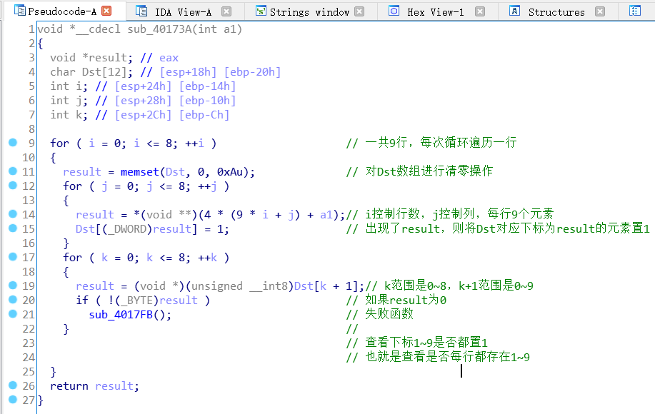

大致功能为将内存中数据看做9*9的矩阵，遍历每行，检测每行是不是都含有1~9这9个数。

sub_4016A3(a1)函数：检测每列是不是含有1~9这九个数

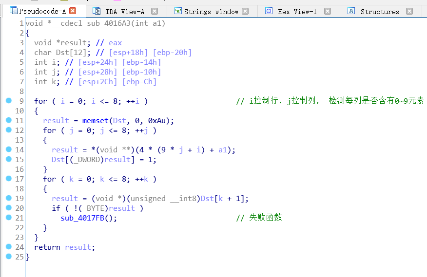

sub_4015C9(a1)函数，有点难看。

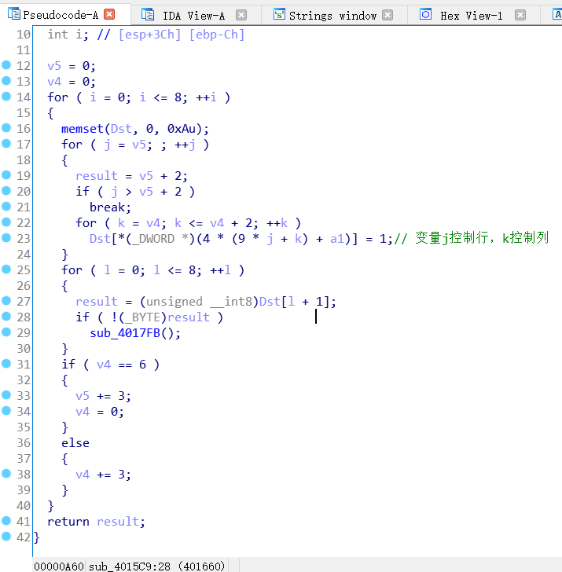

将代码拷贝下来，自己添加一个长度为81的数组，写一个输出遍历元素的代码，看看遍历的规律。

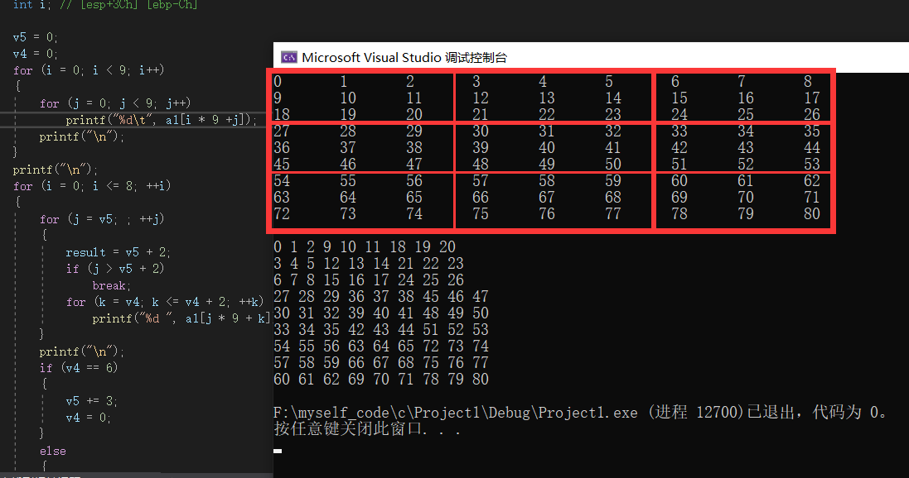

可以看到他将81个元素分成了9个小方块，检测每个小方块里是不是都含有1~9

代码

```c
#include <stdio.h>
int main()
{
    int a1[81] = { 0,1,2,3,4,5,6,7,8,
        9,10,11,12,13,14,15,16,17,
        18,19,20,21,22,23,24,25,26,
        27,28,29,30,31,32,33,34,35,
        36,37,38,39,40,41,42,43,44,
        45,46,47,48,49,50,51,52,53,
        54,55,56,57,58,59,60,61,62,
        63,64,65,66,67,68,69,70,71,
        72,73,74,75,76,77,78,79,80 };
    int result;
    int l; // [esp+28h] [ebp-20h]
    int v4; // [esp+2Ch] [ebp-1Ch]
    int v5; // [esp+30h] [ebp-18h]
    int k; // [esp+34h] [ebp-14h]
    int j; // [esp+38h] [ebp-10h]
    int i; // [esp+3Ch] [ebp-Ch]

    v5 = 0;
    v4 = 0;
    for (i = 0; i < 9; i++)
    {
        for (j = 0; j < 9; j++)
            printf("%d\t", a1[i * 9 +j]);
        printf("\n");
    }
    printf("\n");
    for (i = 0; i <= 8; ++i)
    {
        for (j = v5; ; ++j)
        {
            result = v5 + 2;
            if (j > v5 + 2)
                break;
            for (k = v4; k <= v4 + 2; ++k)
                printf("%d ", a1[j * 9 + k]);      // 变量j控制行，k控制列
        }
        printf("\n");
        if (v4 == 6)
        {
            v5 += 3;
            v4 = 0;
        }
        else
        {
            v4 += 3;
        }
    }
}
```

这样对函数的功能就分析透彻了

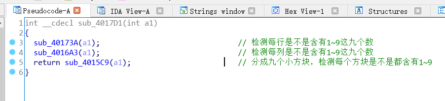

结合题目game，这正好是数独游戏的规则呀

## 程序流程：

将用户输入的从'a'到'j'的字符转换为1到10，

然后遍历内存中的数据，如果内存中的数据为0，则将用户输入的字符填上去一个。

填完后，满足数独游戏的规则。

## 开始解题：

先将内存里的数据提取出来

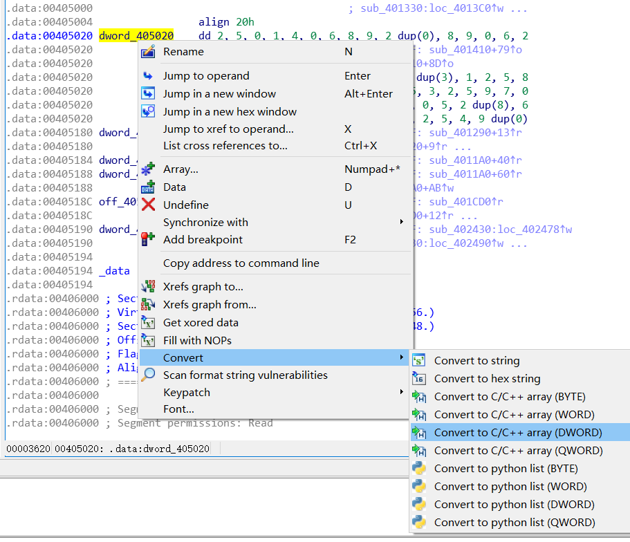

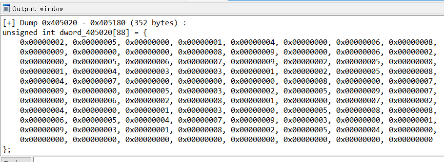


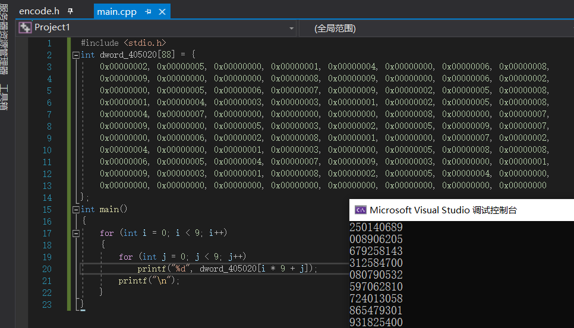

搜索一个解数独游戏的在线网站，填入数据

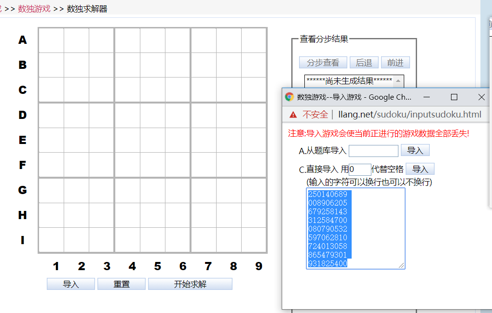

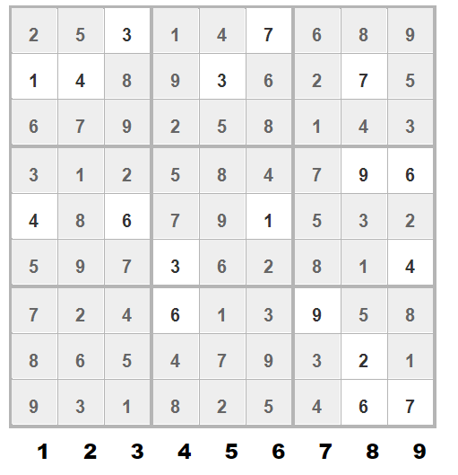

将填入的数字取出来，然后加上96转换为字符

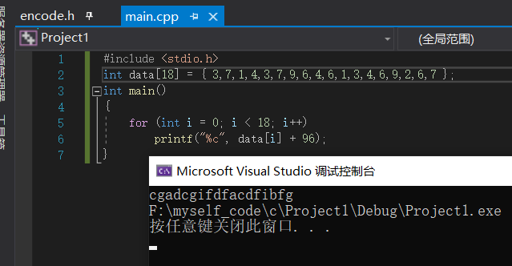

得到最终的flag

```
flag{cgadcgifdfacdfibfg}
```

