## 题目分析

IDA载入，shift+F12查看字符串，根据字符串找到关键代码

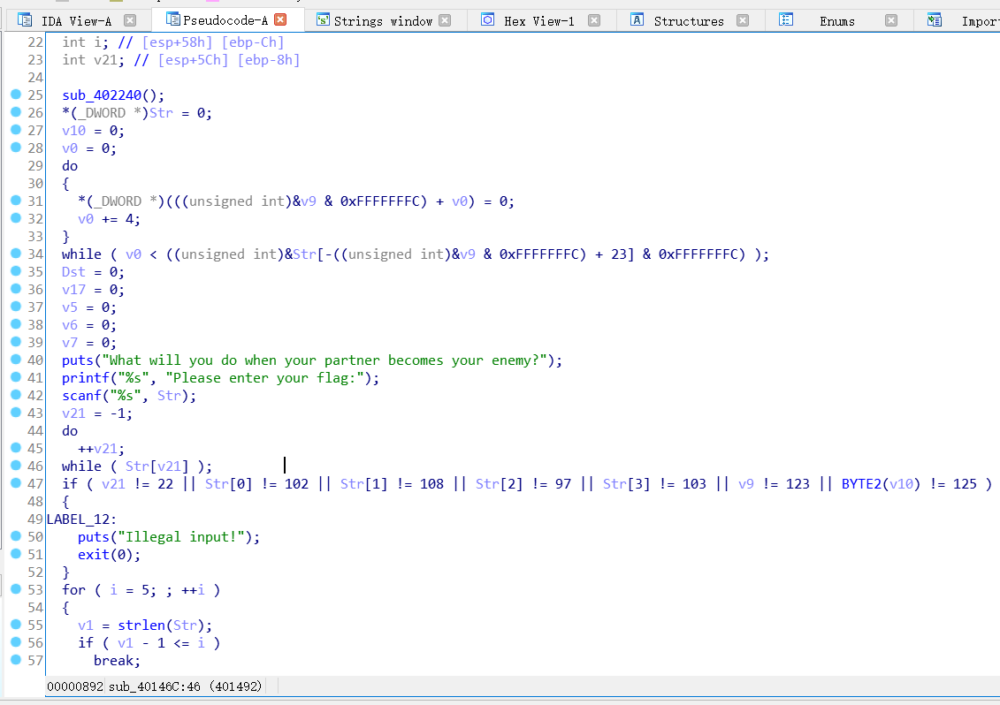

上面IDA自动给生成的Str的长度为4，下面验证str的长度为22，于是我们手动更改Str的类型为char Str[23]，就能正常显示

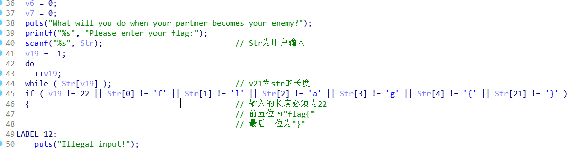

题目为tea，用IDA的Findcrypt插件查找一下，果然是tea系列的加密算法

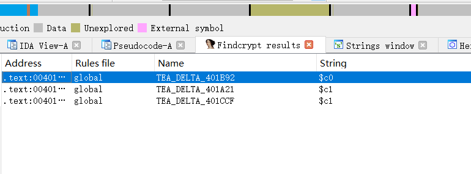

分析出a1为加密数，a2为长度，a3为加密的密钥

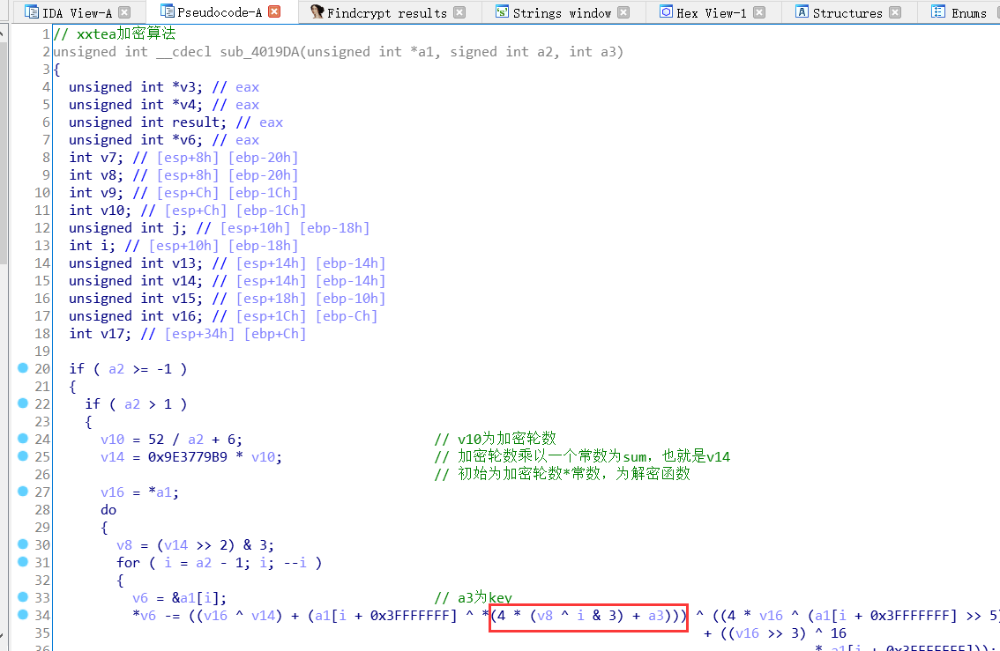

先返回之前的主函数继续分析。

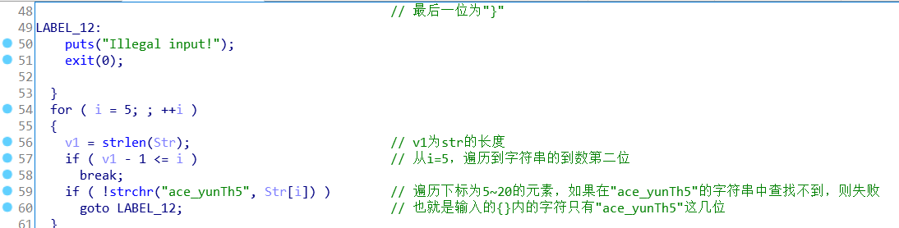

然后分析一下sub_4017DC函数

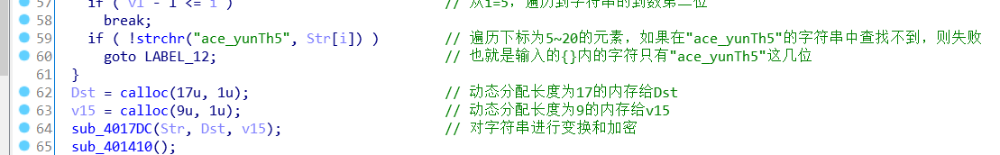

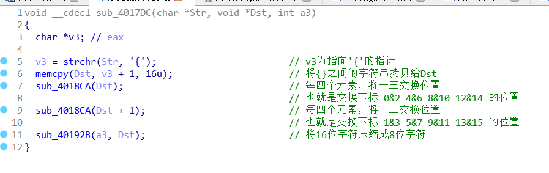

其中sub_40192B函数

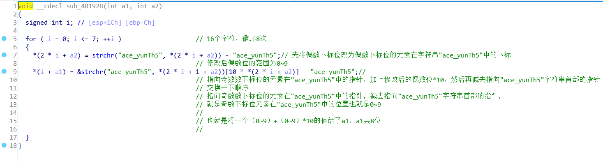

然后下面就是xxtea的函数了，其中sub_401410函数是输出字符串，与flag没太大关系

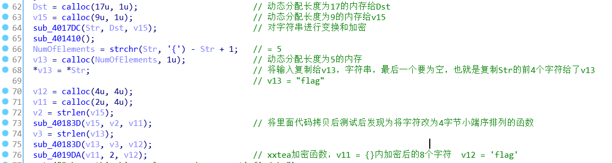

其中sub_4019DA将v11用作加密，v12当作密钥，长度为2

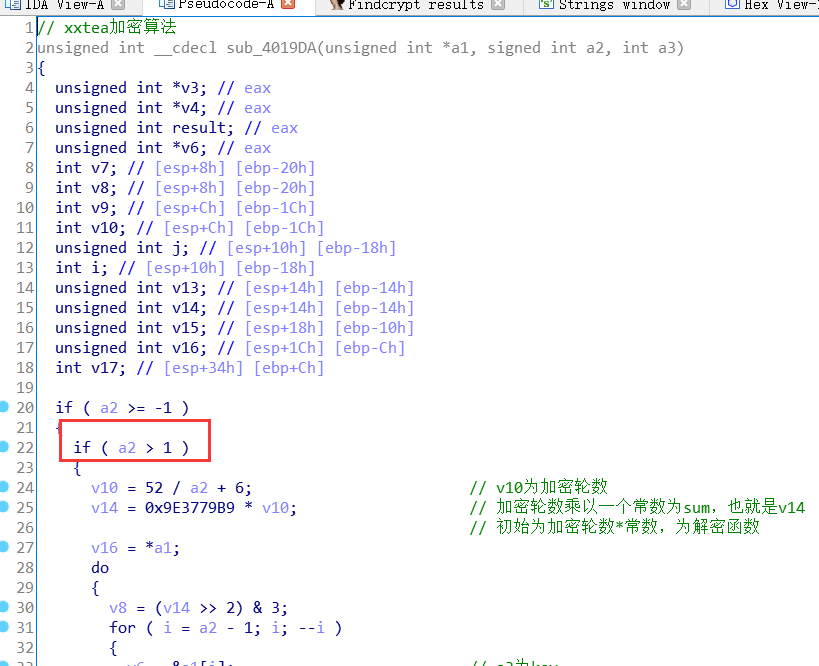

a2=2 >1  执行的是xxtea解密函数

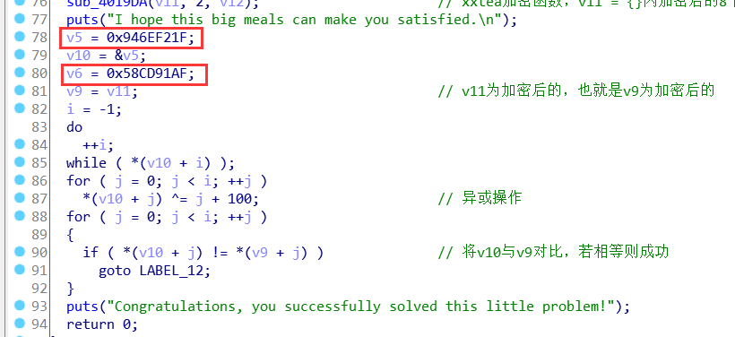

之后将加密后的数据与   在栈上存储的数据与100+下标异或后的数据   进行比对，若相等则成功。

**梳理一下程序流程**：

用户输入长度要等于22

前五位要为flag{，最后一位要为}

然后判断{}内的字符是否都在“ace_yunTh5”内

之后对{}中的字符进行移位，然后将每两位字符转换为一位字符

之后进行xxtea解密

再与栈上的存储的数据与100+j异或后的数据相比对，如果都匹配上则成功。

## 编写脚本

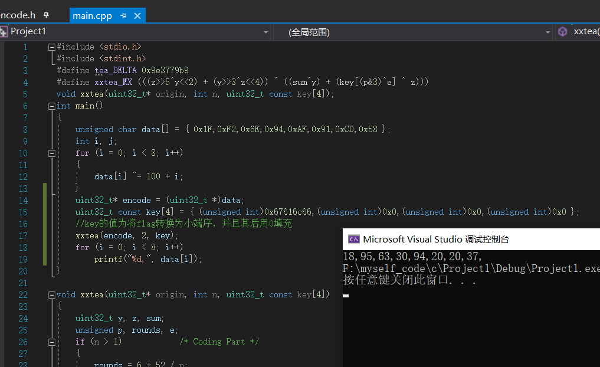

先算出加密后的八位字符。

```c
#include <stdio.h>
#include <stdint.h>
#define tea_DELTA 0x9e3779b9
#define xxtea_MX (((z>>5^y<<2) + (y>>3^z<<4)) ^ ((sum^y) + (key[(p&3)^e] ^ z)))
void xxtea(uint32_t* origin, int n, uint32_t const key[4]);
int main()
{
	unsigned char data[] = { 0x1F,0xF2,0x6E,0x94,0xAF,0x91,0xCD,0x58 };
	int i, j;
	for (i = 0; i < 8; i++)
	{
		data[i] ^= 100 + i;
	}
	uint32_t* encode = (uint32_t *)data;
	uint32_t const key[4] = { (unsigned int)0x67616c66,(unsigned int)0x0,(unsigned int)0x0,(unsigned int)0x0 };
	//key的值为将flag转换为小端序，并且其后用0填充
	xxtea(encode, 2, key);
	for (i = 0; i < 8; i++)
		printf("%d,", data[i]);
}

void xxtea(uint32_t* origin, int n, uint32_t const key[4])
{
	uint32_t y, z, sum;
	unsigned p, rounds, e;
	if (n > 1)            /* Coding Part */
	{
		rounds = 6 + 52 / n;
		sum = 0;
		z = origin[n - 1];
		do
		{
			sum += tea_DELTA;
			e = (sum >> 2) & 3;
			for (p = 0; p < n - 1; p++)
			{
				y = origin[p + 1];
				z = origin[p] += xxtea_MX;
			}
			y = origin[0];
			z = origin[n - 1] += xxtea_MX;
		} while (--rounds);
	}
	else if (n < -1)      /* Decoding Part */
	{
		n = -n;
		rounds = 6 + 52 / n;
		sum = rounds * tea_DELTA;
		y = origin[0];
		do
		{
			e = (sum >> 2) & 3;
			for (p = n - 1; p > 0; p--)
			{
				z = origin[p - 1];
				y = origin[p] -= xxtea_MX;
			}
			z = origin[n - 1];
			y = origin[0] -= xxtea_MX;
			sum -= tea_DELTA;
		} while (--rounds);
	}
}
```

由于二位字符表示一位字符的过程不可逆，因为我们知道两个字符的范围都是0~9，所以采用爆破法。

另外交换位置那部分可以采用IDA伪代码简单变换，因为正向逆向加密是没区别的，正向再交换一次就交换回来了。

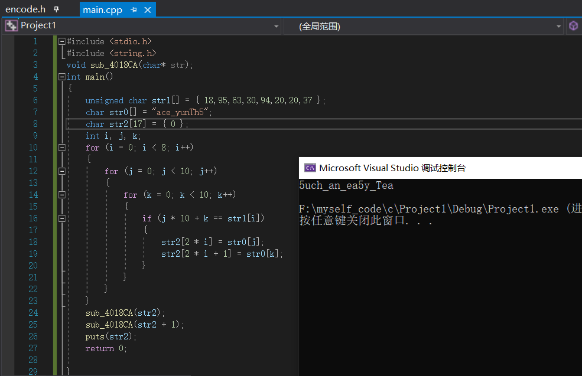

```c
#include <stdio.h>
#include <string.h>
void sub_4018CA(char* str);
int main()
{
	unsigned char str1[] = { 18,95,63,30,94,20,20,37 };
	char str0[] = "ace_yunTh5";
	char str2[17] = { 0 };
	int i, j, k;
	for (i = 0; i < 8; i++)
	{
		for (j = 0; j < 10; j++)
		{
			for (k = 0; k < 10; k++)
			{
				if (j * 10 + k == str1[i])
				{
					str2[2 * i] = str0[j];
					str2[2 * i + 1] = str0[k];
				}
			}
		}
	}
	sub_4018CA(str2);
	sub_4018CA(str2 + 1);
	puts(str2);
	return 0;
	
}
void sub_4018CA(char* str)
{
	int i;
	char k;
	for (i = 0; i < strlen(str); i += 4)
	{
		k = str[i];
		str[i] = str[i + 2];
		str[i + 2] = k;
	}
}
```

这样就得到{}内部的字符串，最后包上flag{}

即最终的flag为

```
flag{5uch_an_ea5y_Tea}
```

